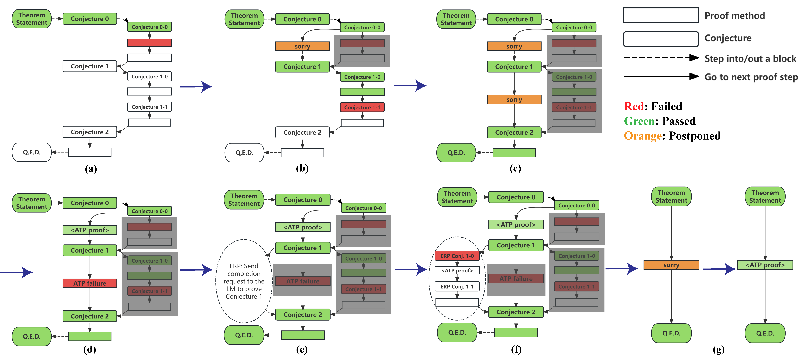

# ProofAug

[](https://haoxiongliu.github.io/ProofAugHomepage/)


This repo implements the ProofAug method introduced in our work ["ProofAug: Efficient Neural Theorem Proving via Fine-grained Proof Structure Analysis"](https://arxiv.org/abs/2501.18310). 



The Isabelle implementation of ProofAug achieves a pass rate of 66.0% on  miniF2F-test in 2100 attempts using the [deepseek-math-7b-base](https://huggingface.co/deepseek-ai/deepseek-math-7b-base) model, setting a new state of the art among existing Isabelle-based methods. Also, the Lean version of ProofAug that can improve the pass@1 performance of [Kimina-Prover-Preview-Distill-1.5B](https://huggingface.co/AI-MO/Kimina-Prover-Preview-Distill-1.5B) by 6.1%.

See [isabelle_src](isabelle_src/) for the Isabelle implementation and [lean_src](lean_src/) for the Lean implementation.

## Contact

If you have any questions, you can raise an issue or contact [liuhx20@mails.tsinghua.edu.cn](mailto:liuhx20@mails.tsinghua.edu.cn). 

## Citation

If you find this work useful , please consider citing:

```bibtex
@article{liu2025proofaug,
  title={ProofAug: Efficient Neural Theorem Proving via Fine-grained Proof Structure Analysis},
  author={Liu, Haoxiong and Sun, Jiacheng and Li, Zhenguo and Yao, Andrew C},
  journal={arXiv preprint arXiv:2501.18310},
  year={2025}
}
```